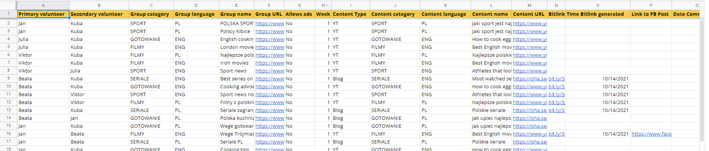
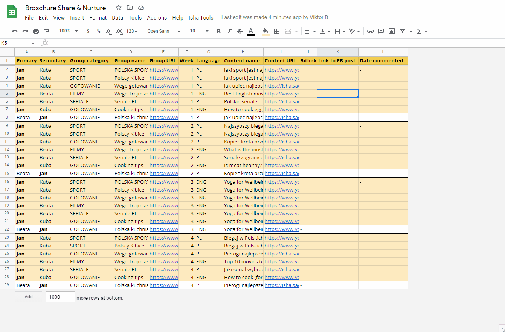
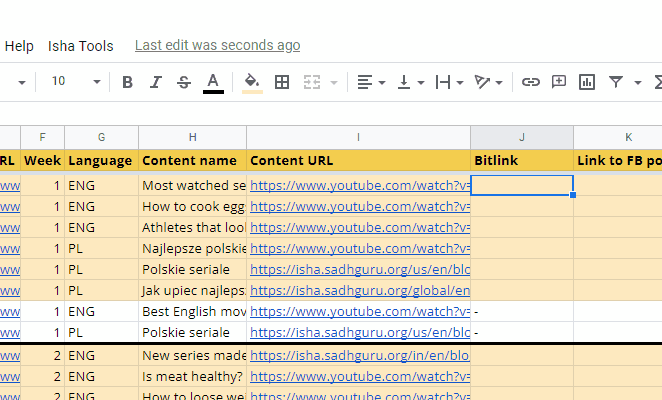
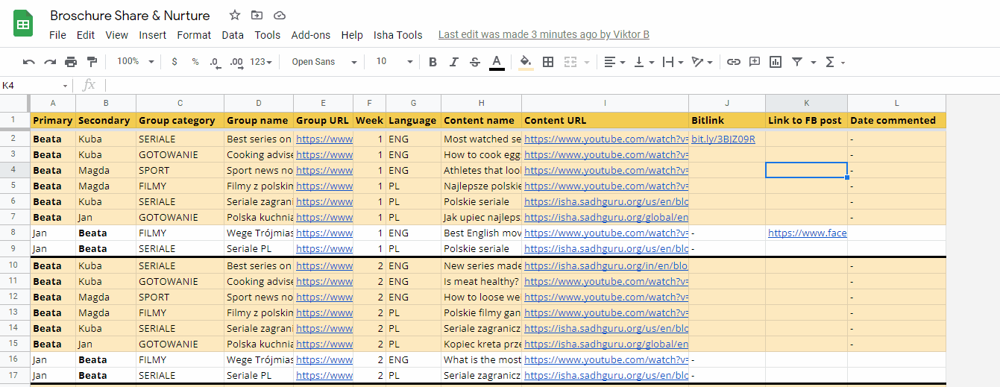
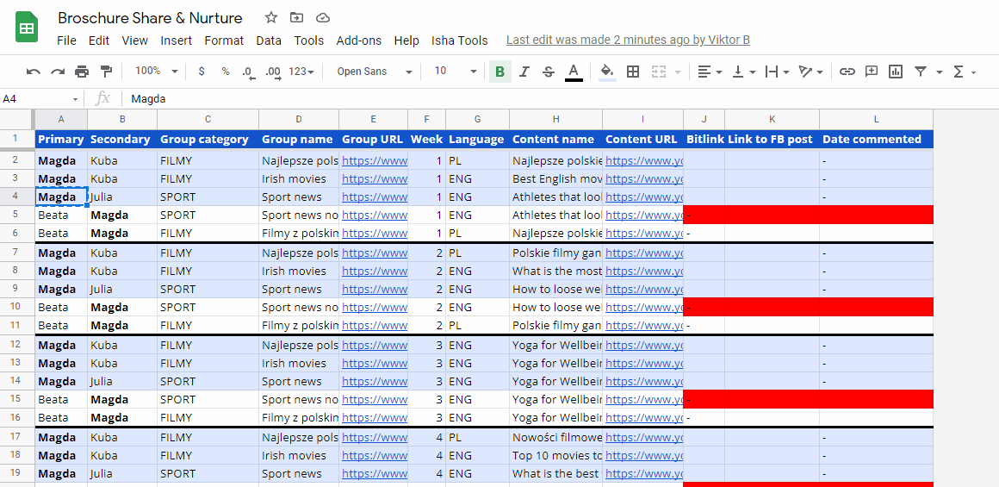
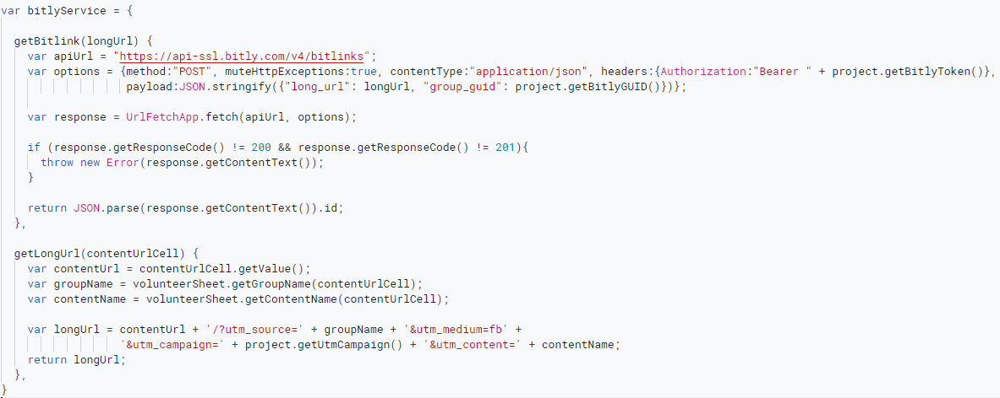
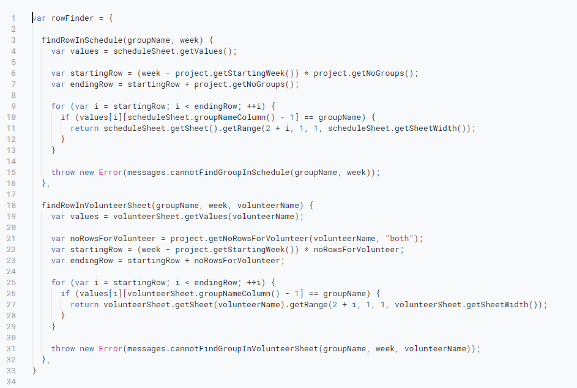

# Share&Nurture Posting App

Posting App for the Share&Nurture Facebook Media Sharing Team at Isha Foundation. The application is used for creating a posting schedule and is a platform for posting content related to Yoga on Facebook groups.
Link to the spreadsheet: https://docs.google.com/spreadsheets/d/1aEwVAFVsE5zDzhRyN-DG1fK8AJcUzxy-IGMHVpcl6wY/edit?usp=sharing

- written in Google Apps Script (JavaScript) with Object-Oriented structure
- Custom functions in Google Sheets (Isha Tools tab, see examples below)
- API calls to the Bitly API for generating Bitly links (UrlFetchApp.fetch())

## Example usage

### #1 sharing a FB post between two sheets
Once the primary volunteer puts the link to the Facebook post on his tab, it gets automatically shared to the secondary volunteer tab.

 

### #2 creating a Bitly link from a Youtube link with Bitly API
Creating short URLs bit.ly/3lWmCCW from long URLs https://www.youtube.com/watch?v=46DnVgHD_FM/?utm_source=Best%20series%20on%20Netflix&utm_medium=fb&utm_campaign=poleng&utm_content=Most%20watched%20series%20on%20Netflix
The UTM parameters are saved and later used by a different application for bitly tracking.

### #3 marking a group for deletion
Deleting a group once we decide we are not posting content in it anymore.

### #4 replacing a posting person
Changes the volunteer name throughout the spreadsheet and manages access to the spreadsheet for a new person.

## Code snippets

Bitly API call

Rowfinder class

